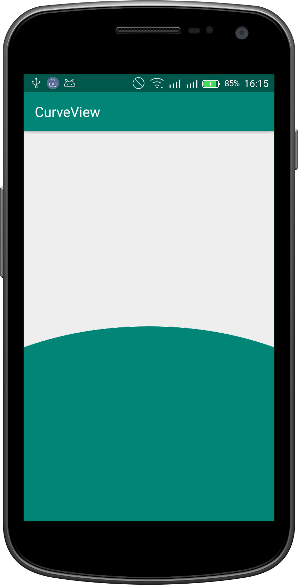
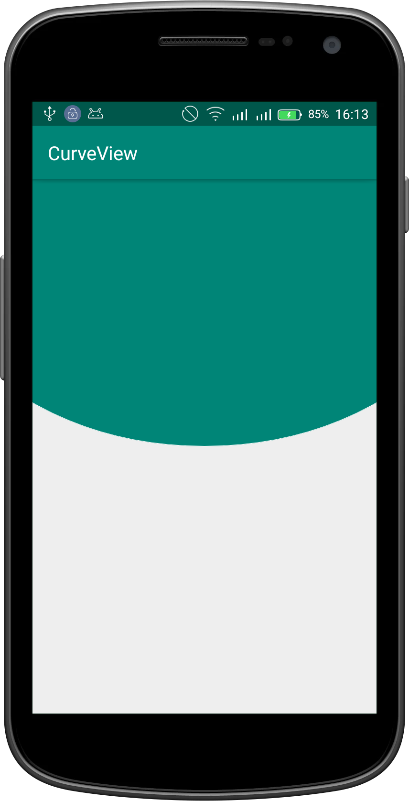

## CurveView
Android View with a curved edge.
Initial project is [here](https://github.com/akhilesh9205/CurveView). The last commit  was in 2017, so I took it and converted to kotlin.

[  ](https://bintray.com/carloscj6/Libs/SimpleAdapter/1.0.0/link)

## Table of Contents  
1. [Gradle dependency](#gradle-dependency)  
2. [Usage](#usage)  
3. [Methods](#methods)  
4. [Contribution](#contribution)  
5. [Author](#author)  
6. [Support](#support)  
7. [License](#license)  

<h3 id="gradle-dependency">Gradle-dependency</h3>  

```gradle  
dependencies {  
 ...
 implementation
 }  
```  
<h3 id="usage">Usage</h3>  

>XML
``` xml
<com.revosleap.curveview.CurveView  
  android:layout_width="match_parent"  
  android:layout_height="0dp"  
  android:layout_weight="1"  
  app:cv_curve_direction="top"  
  app:cv_background_color="@color/colorPrimary"  
  app:cv_border_color="@color/colorAccent"  
  app:cv_border_width="1dp"/>
```
> Kotlin  
```kotlin  
val curveView = CurveView(context)  
```  
> Java
```java  
CurveView curveView = new CurveView(context)  
```  
   

<h3 id="methods">Methods</h3>  

All the methods provided by the library are:  
1. `getBorderColor()`
2. `setBorderColor(color: Int)`
3. `getCurveDirection()`
4. `setCurveDirection(direction: Int)`
5. `getBorderWidth()`
6. `setBorderWidth(width: Float`
7. `getBackgroundColor()`
8. `setBackgroundColor(color: Int)`

<h3 id="contribution">Contribution</h3>  

10. Fork  
11. Create feature branch:  `git checkout -b my-feature-branch`  
12. Commit changes:  `git commit -am 'new awesome feature'`  
13. Push to the branch:  `git push origin my-feature-branch`  
14. Submit a pull request   

<h3 id="author">Author</h3>  

  Initial project by [Akhilesh Kumar](https://github.com/akhilesh9205)
Converted to Kotlin by [Kevin Kiprotich](kevinkip.rf.gd)  

<h3 id="support">Support</h3>  

<a href="https://www.buymeacoffee.com/CHFudJf9j" target="_blank"></a>  

<h3 id="license"> License</h3>  

MIT License    

 Copyright (c) 2017 [Akhilesh Kumar](https://github.com/akhilesh9205)
Copyright (c) 2019 Kevin Kiprotich    

Permission is hereby granted, free of charge, to any person obtaining a copy    
of this software and associated documentation files (the "Software"), to deal    
in the Software without restriction, including without limitation the rights    
to use, copy, modify, merge, publish, distribute, sublicense, and/or sell    
copies of the Software, and to permit persons to whom the Software is    
furnished to do so, subject to the following conditions:    

The above copyright notice and this permission notice shall be included in all    
copies or substantial portions of the Software.    

THE SOFTWARE IS PROVIDED "AS IS", WITHOUT WARRANTY OF ANY KIND, EXPRESS OR    
IMPLIED, INCLUDING BUT NOT LIMITED TO THE WARRANTIES OF MERCHANTABILITY,    
FITNESS FOR A PARTICULAR PURPOSE AND NONINFRINGEMENT. IN NO EVENT SHALL THE    
AUTHORS OR COPYRIGHT HOLDERS BE LIABLE FOR ANY CLAIM, DAMAGES OR OTHER    
LIABILITY, WHETHER IN AN ACTION OF CONTRACT, TORT OR OTHERWISE, ARISING FROM,    
OUT OF OR IN CONNECTION WITH THE SOFTWARE OR THE USE OR OTHER DEALINGS IN THE    
SOFTWARE.
